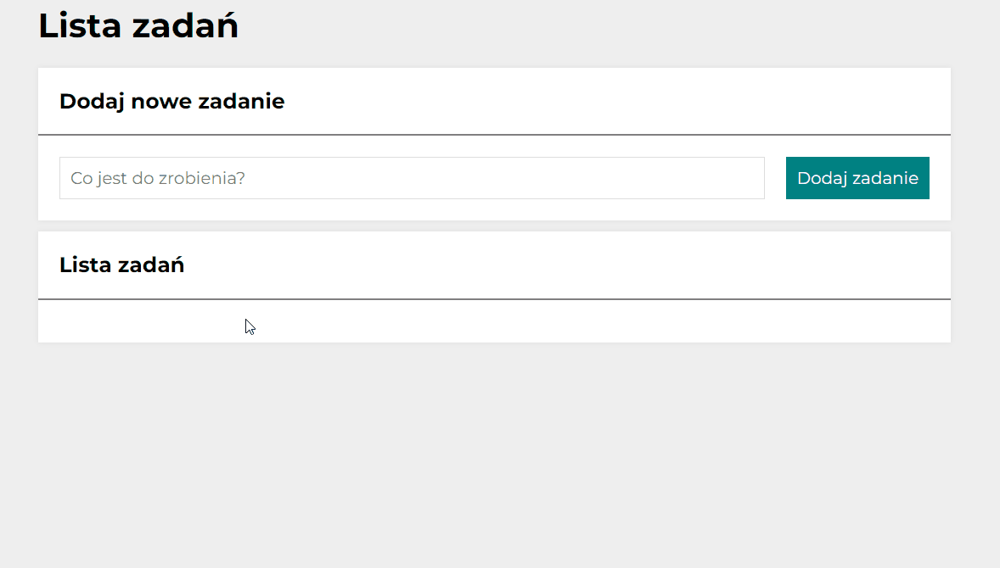

# To do list

## Demo

https://michalolszewski0808.github.io/to_do_list/

## Description

A handy list used to save scheduled tasks. Allows you to add, delete and mark tasks as completed.

## User manual
> Add the task you want to do
> Check the green button if the task has been completed
> Check the red button to delete an unnecessary task

### Technologies used
- HTML
- CSS
- JS ES6+
- BEM convention

### Features
- Visual styling
- Sample Grid/Flexbox layouts
- Media queries
